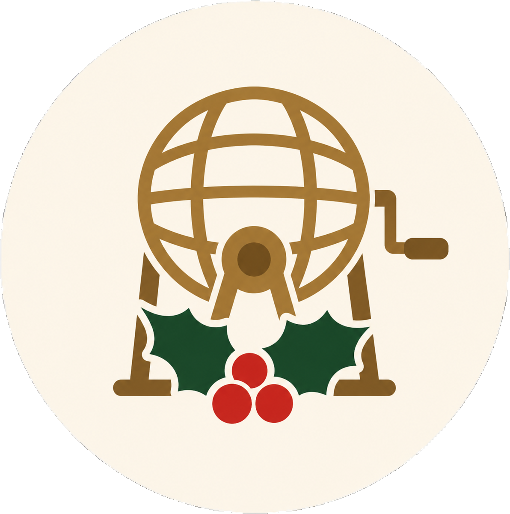

#  La Quina de Nadal

<div align="center">


**El joc tradicional de Nadal, ara al teu mòbil o ordinador.**

[🎮 Jugar ara](https://litools-lab.github.io/quina-nadal/) · [🐛 Reportar un error](../../issues) · [💡 Suggerir una millora](../../issues)

</div>

---

## ✨ Funcionalitats

### 🎱 Mode Presentador
- Bombo virtual que extreu números aleatoris de l'1 al 90
- **90 frases típiques catalanes** per amenitzar cada número (ex: 13 → *"El tretze, la mala sort!"*)
- Graella visual dels 90 números amb marcatge dels sortits
- Historial dels últims 6 números extrets
- **Mode correcció** per marcar i desmarcar números manualment (activat amb triple clic sobre el títol)
- Confeti en acabar la partida 🎉

### 🎴 Mode Participant
- **Cartrons aleatoris** — tria quants cartrons vols jugar, sense límit
- **Cartrons per codi** — cada codi d'entrada genera un cartró únic i recuperable; pots afegir múltiples codis per jugar amb diversos cartrons alhora
- **Escàner QR** — en dispositius mòbils, escaneja el codi directament des de la càmera
- Cartrons generats seguint les regles oficials:
  - 3 files × 9 columnes (per dècades)
  - Exactament **5 números per fila**
  - Màxim **2 números per columna**
  - Números de cada columna ordenats de menor a major
  - Caselles buides amb trama decorativa, com els cartrons físics
- Marcatge manual clicant els números
- **Detecció automàtica** de Línia i Quina amb alerta i confeti
- Nova partida amb els **mateixos cartrons** o amb **cartrons nous**

---

## 🔑 Cartrons per codi

Els cartrons per codi utilitzen un generador pseudoaleatori determinista (*PRNG amb seed*). Això significa que:

- El mateix codi **sempre genera exactament el mateix cartró**, en qualsevol dispositiu i en qualsevol moment
- Codis diferents generen cartrons diferents
- **No cal cap base de dades** — tot el càlcul és local al navegador
- Els participants poden **recuperar el seu cartró** tornant a introduir el codi

Pots distribuir codis correlatius (ex: `NADAL-001` fins a `NADAL-200`) i imprimir-los a les entrades.

---

## 🚀 Accés ràpid

Pots jugar directament sense instal·lar res:

**👉 [https://litools-lab.github.io/quina-nadal/](https://litools-lab.github.io/quina-nadal/)**

Compatible amb tots els navegadors moderns (Chrome, Firefox, Safari, Edge) i dispositius (mòbil, tauleta, escriptori).

---

## 🛠️ Tecnologies

- **HTML5 / CSS3 / JavaScript vanilla** — sense cap dependència externa ni frameworks
- **Google Fonts** — Playfair Display + Lato
- **PRNG determinista** — algoritme mulberry32 + hash FNV-1a per a cartrons per codi
- **BarcodeDetector API** — escàner QR natiu del navegador (Chrome i Safari moderns)
- **Responsive** — adaptat a qualsevol mida de pantalla

---

## 🗂️ Estructura del projecte

```
quina-nadal/
├── index.html          # Aplicació completa (HTML + CSS + JS)
├── frases.js           # Les 90 frases del presentador
├── assets/
│   └── favicon.png     # Icona de l'aplicació
├── LICENSE             # Llicència MIT
├── CHANGELOG.md        # Historial de canvis
├── CONTRIBUTING.md     # Com contribuir al projecte
├── SECURITY.md         # Política de seguretat
└── .github/
    └── ISSUE_TEMPLATE/
        ├── bug_report.md
        ├── feature_request.md
        └── proposta_frases.md
```

---

## 📦 Instal·lació local

No cal cap servidor ni npm. Simplement:

```bash
git clone https://github.com/litools-lab/quina-nadal.git
cd quina-nadal
# Obre index.html al navegador
open index.html        # macOS
start index.html       # Windows
xdg-open index.html    # Linux
```

---

## 🗺️ Full de ruta

| Fase | Descripció | Estat |
|------|-----------|-------|
| 1 | Web accessible via GitHub Pages | ✅ **Llest** |
| 2 | Cartrons per codi únic i escàner QR | ✅ **Llest** |
| 3 | PWA instal·lable (manifest + service worker) | 🔜 Pendent |
| 4 | Sincronització en temps real (presentador ↔ participants) | 🔜 Pendent |
| 5 | App nativa (iOS / Android via Capacitor) | 🔜 Pendent |

---

## 🤝 Com contribuir

Les contribucions són benvingudes! Consulta [CONTRIBUTING.md](CONTRIBUTING.md) per a les instruccions detallades.

En resum:
1. Fes un **Fork** del repositori
2. Crea una branca: `git checkout -b feature/nova-funcionalitat`
3. Fes els teus canvis i commiteja: `git commit -m 'feat: afegir nova funcionalitat'`
4. Puja la branca: `git push origin feature/nova-funcionalitat`
5. Obre un **Pull Request**

### 🗣️ Proposa frases noves

Contribuir frases és la manera més senzilla de participar, **sense necessitat de saber programar**. Obre un issue amb la plantilla [Proposta de frases](../../issues/new?template=proposta_frases.md).

---

## 🐛 Reportar errors

Si trobes algun problema:

1. Ves a la secció [Issues](../../issues)
2. Clica **New issue → Bug report**
3. Descriu el problema amb el màxim detall possible

---

## 📄 Llicència

Aquest projecte està sota la llicència **MIT**. Consulta el fitxer [LICENSE](LICENSE) per a més informació.

---

<div align="center">

Fet amb ❤️ per a les festes de Nadal · Catalunya<br>
<a href="https://github.com/litools-lab">LiTools</a>

</div>
